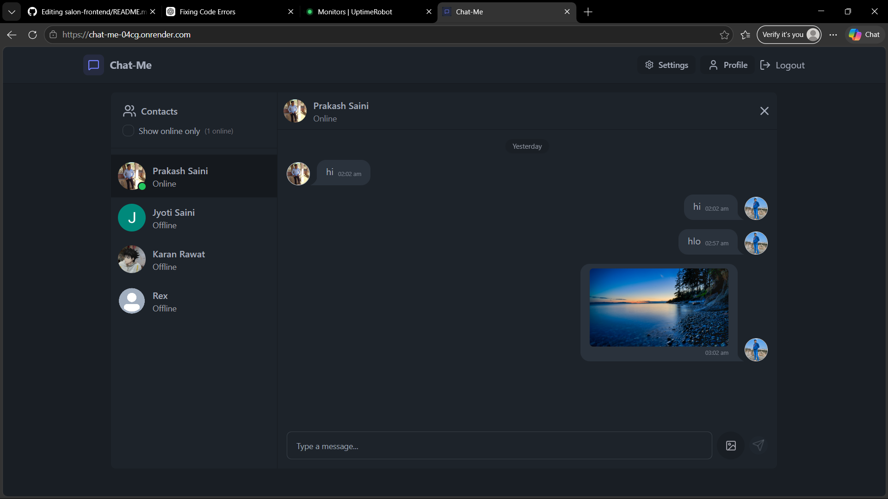
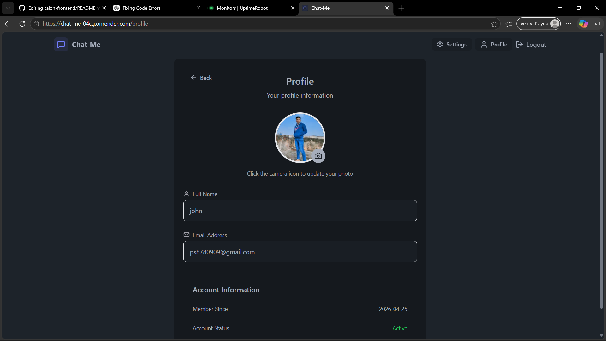
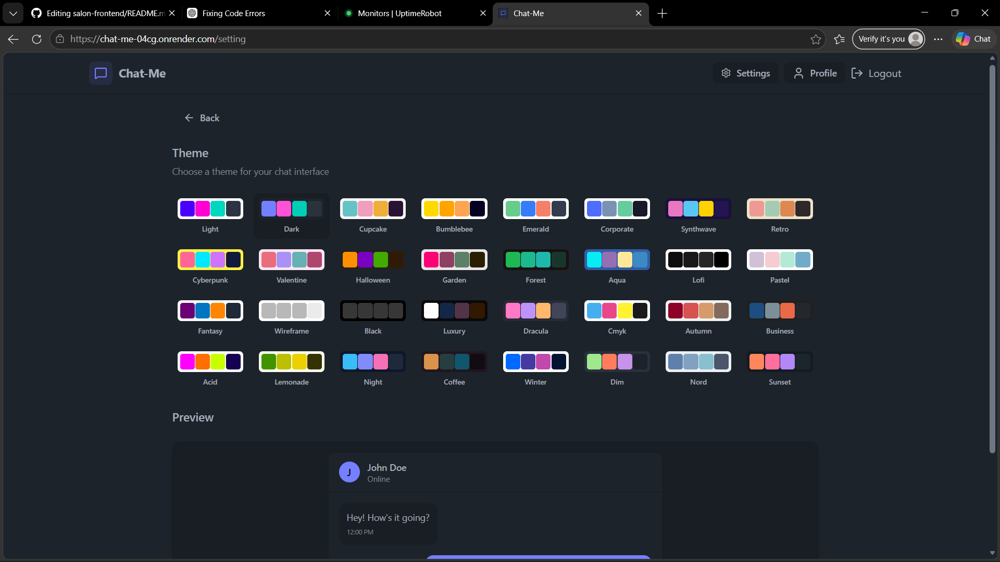

# 💬 Chat-Me Web App

A modern **real-time chat application** built using the **MERN stack** with features like authentication, email verification, Google OAuth, image sharing, and live messaging using WebSockets.

---

## 🚀 Live Demo

🌐 https://chat-me-04cg.onrender.com

---

## ✨ Features

- 🔐 Secure Authentication (JWT + Cookies)
- 📧 Email Verification System
- 🔑 Google OAuth Login (Passport.js)
- 💬 Real-time Chat (Socket.io)
- 🟢 Online / Offline Status
- 🖼️ Send Images in Chat (Cloudinary)
- ⏳ Image Sending Loader
- 👤 Profile Picture Upload
- 🎨 Multiple Theme Support (Light / Dark / etc.)
- 📱 Fully Responsive UI
- ⚡ Optimistic UI Updates

---

## 🛠️ Tech Stack

### Frontend
- React.js (Vite)
- Tailwind CSS + DaisyUI
- Zustand (State Management)
- Axios
- React Router
- React Hot Toast
- Lucide Icons

### Backend
- Node.js
- Express.js
- MongoDB + Mongoose
- Socket.io
- JWT Authentication
- Passport.js (Google OAuth)
- Nodemailer (Email Verification)
- Cloudinary (Image Upload)
- bcrypt.js

---

---

## ⚙️ Environment Variables

Create `.env` file in **backend/**

```env

PORT=5000
NODE_ENV=development

MONGO_URI=your_mongodb_uri

JWT_SECRET=your_jwt_secret

CLIENT_URL=http://localhost:5173
SERVER_URL=http://localhost:5000

CLOUDINARY_CLOUD_NAME=your_cloud_name
CLOUDINARY_API_KEY=your_api_key
CLOUDINARY_API_SECRET=your_api_secret

GOOGLE_CLIENT_ID=your_google_client_id
GOOGLE_CLIENT_SECRET=your_google_client_secret

NODEMAILER_PASS=your_nodemailer_pass
NODEMAILER_EMAIL=your_nodemailer_email
NODEMAILER_SERVICE=gmail
NODEMAILER_SECURE=true
NODEMAILER_PORT=465

```

---

## 📸 Screenshots

<p align="center">
  
  
  
</p>

---

## ⚙️ Installation 

### 1. Clone the repository

```bash
git clone https://github.com/prakashs0909/Chat-Me.git
cd Chat-Me
```

### 2. Install dependencies

#### Backend

```bash
cd backend
npm install
```

#### Frontend

```bash
cd frontend
npm install
```

---

### 3. Run Locally

#### Start Backend

```bash
cd backend
npm run dev
```

#### Start Frontend

```bash
cd frontend
npm run dev
```

---

## 👨‍💻 Author
Prakash Saini

🔗 GitHub: https://github.com/prakashs0909

---

## ⭐ Show your support

If you like this project, please ⭐ the repo!
